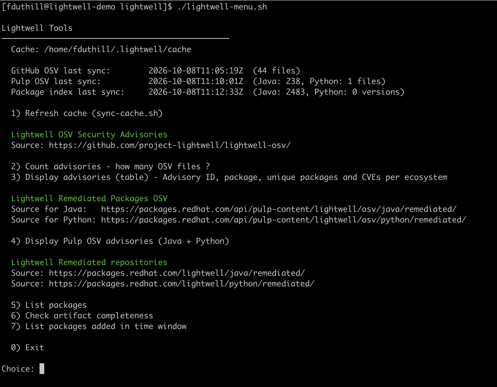

# Lightwell Scripts

## Standalone scripts

| Script | Data source | CSV export | Description |
|---|---|:---:|---|
| `count-advisories.sh` | GitHub (`lightwell-osv`) | | Counts the total number of advisory JSON files in the public Lightwell OSV GitHub repository. |
| `count-remediations.sh` | GitHub (`lightwell-osv`) | ✓ | Fetches all advisories from the GitHub repo and displays a table of remediations grouped by ecosystem (Maven / PyPI), showing the remediated version and CVEs fixed per package, plus a summary count of advisories, packages and CVEs. |
| `map-lightwell-osv-advisories.sh` | GitHub (`lightwell-osv`) | ✓ | Produces a mapping table of every advisory in the GitHub repo: advisory filename, advisory ID, OSV schema version, ecosystem, package name, remediated version and CVEs fixed. Includes a per-ecosystem summary (unique advisories, packages and CVEs). |
| `map-lightwell-pulp-osv-advisories.sh` | Pulp (`packages.redhat.com`) | ✓ | Same mapping as above but fetches from the authenticated Pulp OSV endpoints for both Java and Python (`/lightwell/osv/java/remediated/` and `/lightwell/osv/python/remediated/`). Includes a per-ecosystem summary (OSV files, CVEs, novel vulns, packages and versions). Requires `_user` / `_pass` credentials. |
| `list-java-remediated-packages.sh` | Pulp (`packages.redhat.com`) | ✓ | Crawls the Lightwell Java Maven repository starting from the HTML root listing and enumerates all unique packages (`groupId:artifactId`) with their remediated versions. Requires credentials. |
| `list-java-remediated-packages-prefixes.sh` | Pulp (`packages.redhat.com`) | ✓ | Same as `list-java-remediated-packages.sh` but uses `.meta/prefixes.txt` as the entry point instead of the root HTML listing, launching one crawl thread per prefix for faster enumeration. Use both scripts and compare totals to validate completeness. Requires credentials. |
| `list-added-packages.sh` | Pulp (`packages.redhat.com`) | ✓ | Interactive script that lists packages added to the Lightwell Java and/or Python repositories within a time window. Prompts for ecosystem (Java / Python / Both), time filter (last N hours or between two dates), then outputs a table of added packages with their version and timestamp. Requires credentials. |
| `check-java-remediated-artifacts.sh` | Pulp (`packages.redhat.com`) | ✓ | Crawls the Lightwell Java Maven repository and checks for each package version whether the expected artifact files are present: `.jar`, `.pom`, `sources.jar`, `test-sources.jar`, `cyclonedx.json`, `.provenance.sigstore.json`. Outputs one row per package version with `X` (present) or `-` (absent) per artifact type, followed by a per-category missing count. Requires credentials. |

---

## Local cache scripts

These two scripts form a local caching layer. Run `sync-cache.sh` once to populate the cache, then use `lightwell-menu.sh` for instant queries without hitting the network.

### `sync-cache.sh`

Builds and refreshes `~/.lightwell/cache/` from three sources:

| Source | Cache location | Notes |
|---|---|---|
| GitHub OSV advisories | `github-advisories/*.json` | Public, no credentials needed |
| Pulp OSV advisories | `pulp-java-advisories/*.json`, `pulp-python-advisories/*.json` | Requires credentials |
| Package repositories | `maven-index.json` | Crawls Java + Python repos; slow (several minutes) |

The package index (`maven-index.json`) stores one entry per package version with ecosystem, package name, version, timestamp, and artifact presence flags.

### `lightwell-menu.sh`

Unified interactive menu. All queries run against the local cache (sub-second). Displays sync timestamps and file counts at the top.

| Option | Section | Description |
|---|---|---|
| **1** | — | Refresh cache (`sync-cache.sh`) |
| **2** | Lightwell OSV Security Advisories | Count advisories — how many OSV files in the GitHub repo? |
| **3** | Lightwell OSV Security Advisories | Display advisories table — Advisory ID, package, remediated version, CVEs; per-ecosystem summary of unique advisories, packages and CVEs |
| **4** | Lightwell Remediated Packages OSV | Display Pulp OSV advisories (Java + Python) — same mapping table as option 3 but from the authenticated Pulp endpoints; per-ecosystem summary |
| **5** | Lightwell Remediated repositories | List packages — prompts for ecosystem (Java / Python / Both); shows all packages with their remediated versions |
| **6** | Lightwell Remediated repositories | Check artifact completeness — prompts for ecosystem; shows per-version presence of expected artifacts (`jar`, `pom`, `sources.jar`, `test-sources.jar`, `cyclonedx.json`, `provenance.sigstore.json` for Java; `whl`, `tar.gz`, `cyclonedx.json`, `provenance.sigstore.json` for Python) with a per-category missing count |
| **7** | Lightwell Remediated repositories | List packages added in time window — prompts for ecosystem and time filter (last N hours or date range); shows packages with their ecosystem, version and timestamp |

**Data sources used by the menu:**

| Section | Source URL |
|---|---|
| Lightwell OSV Security Advisories | `https://github.com/project-lightwell/lightwell-osv/` |
| Lightwell Remediated Packages OSV (Java) | `https://packages.redhat.com/api/pulp-content/lightwell/osv/java/remediated/` |
| Lightwell Remediated Packages OSV (Python) | `https://packages.redhat.com/api/pulp-content/lightwell/osv/python/remediated/` |
| Lightwell Remediated repositories (Java) | `https://packages.redhat.com/lightwell/java/remediated/` |
| Lightwell Remediated repositories (Python) | `https://packages.redhat.com/lightwell/python/remediated/` |
